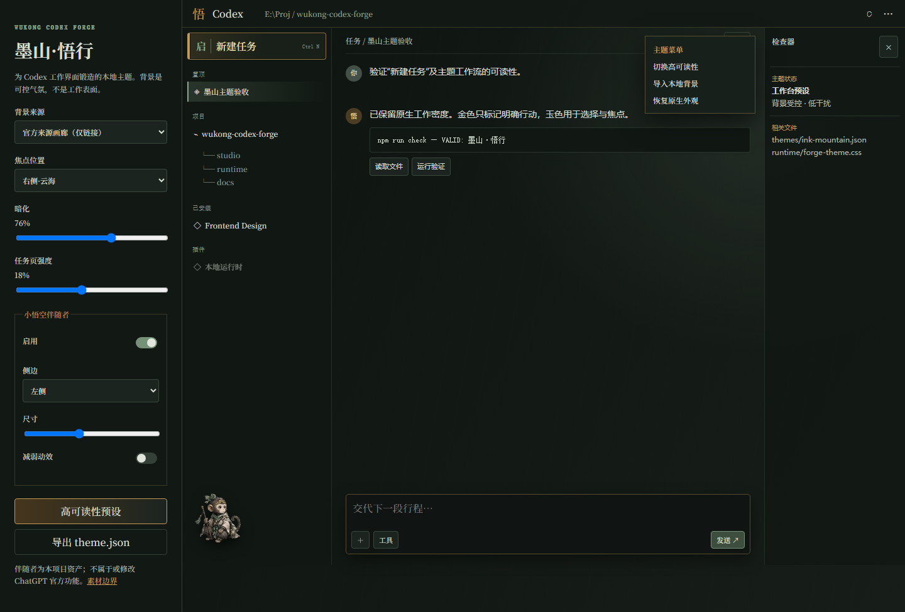

# Wukong Codex Forge

一个面向 Windows ChatGPT/Codex 桌面端的《黑神话：悟空》主题工具与 Theme Studio。它不是“换背景”：墨色山海、岩壁分层、低饱和玉色状态与克制金色主命令覆盖工作界面的导航、项目树、会话、代码、编辑器、检查器、菜单、焦点和滚动条。

## Included

- 启行 / 新建任务：保留中文文本与原生点击，重做为明确主命令，含边界、悬停、按下、禁用、键盘焦点与窄侧栏状态。
- Theme Studio：真实工作台预览项目树、对话、代码块、输入框、工具栏、右栏和菜单；可调本地/画廊背景、焦点、暗化、任务页强度、高可读性预设和 reduced-motion。
- 小行者伴随者：原创生成资产，可关闭、左右放置、调尺寸、减弱动效；默认不遮挡输入框和菜单，悬停只显示一句状态。
- 可逆运行时：仅经 127.0.0.1 CDP 注入 CSS，不写 WindowsApps、app.asar、Codex 配置或 Wallpaper Engine。启动时验证监听 PID 路径属于注册的 OpenAI.Codex 包。

## Studio

Run npm install, then npm run studio. Open http://127.0.0.1:5173/studio/ .

## Install, use, restore

Close Codex before installing. Run powershell -NoProfile -ExecutionPolicy Bypass -File .\scripts\install.ps1. It creates only the managed WukongCodexForge folder below LOCALAPPDATA, and does not require admin rights.

To use the optional runtime, launch official Codex yourself with --remote-debugging-address=127.0.0.1 --remote-debugging-port=9222; then run scripts/start.ps1 -Port 9222 from the managed copy.

CDP permits other local processes under the same Windows user to inspect the debug-enabled app. Keep it on 127.0.0.1, do not use an untrusted port/process, and run scripts/restore.ps1 -Port 9222 when finished. To remove only managed files, run scripts/restore.ps1 -Uninstall.

The project does not launch from WindowsApps, change ownership, or alter Store binaries. If a renderer retains cached CSS, close/reopen Codex; no app files need recovery.

## Validation

Run npm run check. Tests validate config schema, background/companion bounds, payload escaping, and loopback guard. Browser validation writes docs/screenshots/theme-studio.png.

## Assets and license

Source links and copyright boundaries: [docs/ASSET_SOURCES.md](docs/ASSET_SOURCES.md). No non-redistributable third-party Black Myth image binary is committed. Code is [MIT](LICENSE); game names, screenshots and official artwork remain their owners' property.
