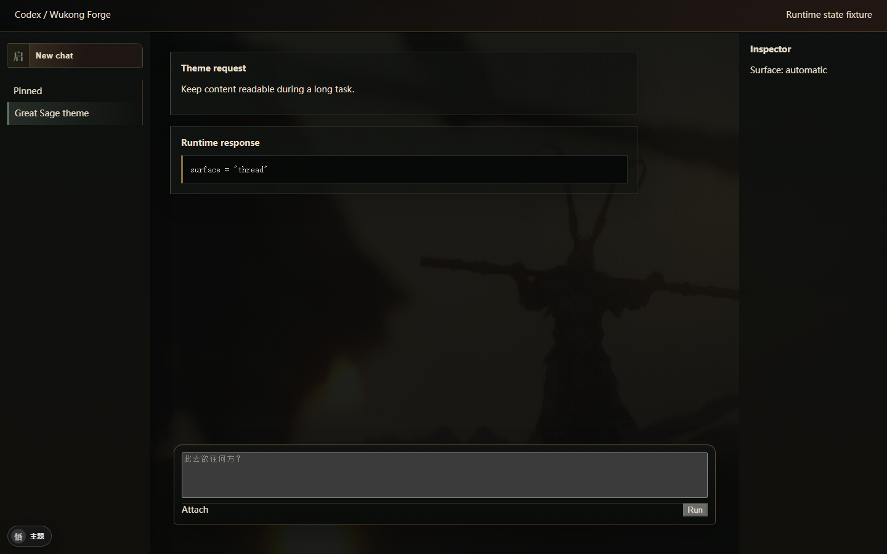

# Wukong Codex Forge

Windows ChatGPT/Codex 桌面端的本地主题工作台。本轮主题“大圣归来 · 残卷入梦”把新建对话设计成高显影的启程封面，把进行中的对话切换为低显影工作态，并提供可即时关闭的小行者、侧栏/控件样式和随 ChatGPT 启停的受管 watcher。




## 核心能力

- 新建对话和对话进行中使用两套明确视觉层级；运行时按消息语义自动切换 `landing / thread`。
- 默认背景是用户提供的 `大圣归来.jpg`。同一张 78 KB 图片通过两组遮罩复用，不加载视频、WebGL 或远程字体。
- “悟”开关即时切换主题与原生外观；关闭时不改变 Codex 的布局、事件和输入路径。
- 新建按钮、侧栏活动项、消息、代码块、输入区、工具栏、菜单、弹窗与滚动条使用受管 `forge-*` 标记。
- 小行者可关闭、左右停驻和调尺寸，始终 `pointer-events:none`，并响应 reduced motion。
- MutationObserver 处理 Codex 路由和动态渲染；120 ms 合并刷新，不监听 class 变化。
- 完整 restore 删除 style、observer、主题节点、标记、状态与本地偏好。

## 安全边界

本项目不修改 WindowsApps、`app.asar`、Codex 配置、Wallpaper Engine 或全局系统设置。运行时只接受 `127.0.0.1` CDP，并验证监听进程位于注册的 `OpenAI.Codex` 包内。

CDP 仍允许同一 Windows 用户下的本地进程检查开启调试的应用。只在你信任的本机账户中使用受管启动器。

## Theme Studio

```powershell
npm install
npm run studio
```

打开 [http://127.0.0.1:5173/studio/](http://127.0.0.1:5173/studio/)。

Studio 可以：

- 切换新建对话/对话态和主题/原生模拟态；
- 调整双状态背景焦点、显影、暗化与小行者；
- 导入本地 PNG/JPEG/WebP（最大 16 MB）；
- 导入/导出经 schema v2 校验的主题 JSON；
- 切换完全移除背景的高可读性预设。

## 安装与随启随停

先关闭所有 ChatGPT 进程，再在项目根目录执行：

```powershell
powershell -NoProfile -ExecutionPolicy Bypass -File .\scripts\install.ps1 -CreateShortcut
```

开始菜单会出现“ChatGPT - 大圣主题”。以后从该入口启动：

1. `launch.ps1` 启动官方 `ChatGPT.exe`，只绑定本机回环 CDP。
2. `watch.mjs` 等待 renderer 就绪并应用主题。
3. 页面重载或新 renderer 出现时自动补注入。
4. ChatGPT 退出、CDP 连失三次后 watcher 自动退出。

这是实现“随 ChatGPT 启动而启动，关闭而关闭”的安全方式。普通 ChatGPT 快捷方式没有 CDP 参数，无法在不修改官方包的前提下注入主题。

安装器只复制运行时、主题、脚本、素材和 `ws`；不会把 `.git`、Studio、测试、截图、Playwright 或 Vite 放进常驻目录。

也可手动附加到已经以回环 CDP 启动的 ChatGPT：

```powershell
powershell -NoProfile -ExecutionPolicy Bypass -File "$env:LOCALAPPDATA\WukongCodexForge\app\scripts\start.ps1" -Port 9222
```

## 导入另一个本地主题

```powershell
Set-Location E:\Proj
powershell -NoProfile -ExecutionPolicy Bypass -File "$env:LOCALAPPDATA\WukongCodexForge\app\scripts\theme.ps1" -Import .\wukong-codex-forge\themes\active.json -Image "E:\GameRecord\Black Myth Wukong\图片\大圣归来.jpg"
```

`theme.ps1` 在切换工作目录前解析绝对路径，只写入受管 `LOCALAPPDATA\WukongCodexForge\app`。

## 恢复与卸载

只恢复当前 renderer：

```powershell
powershell -NoProfile -ExecutionPolicy Bypass -File "$env:LOCALAPPDATA\WukongCodexForge\app\scripts\restore.ps1" -Port 9222
```

卸载受管副本和受管开始菜单入口：

```powershell
powershell -NoProfile -ExecutionPolicy Bypass -File .\scripts\restore.ps1 -Uninstall
```

卸载前会验证目标恰好是 `LOCALAPPDATA\WukongCodexForge`、不是 reparse point、state marker 匹配且快捷方式路径精确一致。任一条件不满足都会拒绝删除。

## 针对性验证

```powershell
npm run validate
npm run test:theme
npm run test:runtime-states
npm run test:lifecycle
npm run test:e2e
```

- `test:theme`：schema v2、双状态变量、本地素材和高可读性。
- `test:runtime-states`：landing/thread 自动识别、主题开关、DOM 动态重标记和完整 restore。
- `test:lifecycle`：回环限制、启动器/watcher/快捷方式/卸载的静态契约。
- `test:e2e`：Studio 双状态、开关、本地导入、导出、无障碍和截图。

## 文档

- [需求与验收](docs/REQUIREMENTS.md)
- [设计与实现](docs/DESIGN.md)
- [分工与交付边界](docs/WORKBREAKDOWN.md)
- [素材来源与发布边界](docs/ASSET_SOURCES.md)

过程工作日志保存在本地 `docs/logs/CHANGELOG.md`，按仓库约定不提交。

## 当前限制

Codex 桌面端 DOM 会随版本变化。fixture 可以证明主题契约和恢复边界，但真实生产 Codex 的最终视觉认证必须从受管主题入口重新启动应用后执行。找不到某个语义节点时运行时会跳过该节点，优先保证原生功能。

代码以 [MIT](LICENSE) 发布；游戏名称、截图与官方艺术作品的权利属于其各自权利人。
