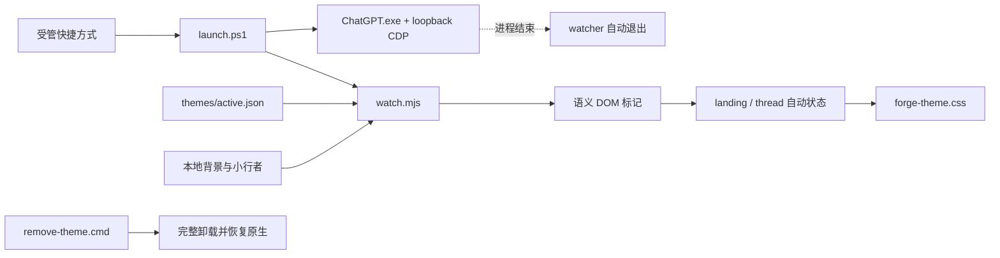

# 大圣归来 · 残卷入梦 — 设计与实现

## 设计判断

参考主题目录里最有效的方案都有同一个共同点：它们为新建页建立了“主画面”，同时保持宿主应用的交互边界清楚。本轮进一步明确为“原生 Codex 骨架 + 悟空视觉皮肤”：三栏结构、顶部菜单、对话流、环境面板、输入框及全部原生尺寸与位置都不改变。

签名动作是“一图，两境”：

1. `landing` 使用用户截图的右侧剪影和夕照，左侧墨幕为标题与提示留出空间。
2. `thread` 使用同一图片、相同缓存和不同遮罩，显影强度降到 13%，避免文字与代码争夺注意力。
3. 高可读性完全移除图片，不依赖“继续加深滤镜”来假装纯色。
4. 不注入主题标题卡、开关、侧栏或底栏；主题差异来自背景、颜色、边界和表面材质。

不采用视频、粒子引擎、WebGL、远程字体或每帧 JavaScript 动画。它们会提高崩溃风险和 GPU/内存成本，却不会改善 Codex 的核心工作流。

## 视觉系统

### 色彩

| Token | 值 | 用途 |
| --- | --- | --- |
| 墨黑 `ink` | `#090b0a` | 全局底色、代码面 |
| 漆褐 `lacquer` | `#211713` | 抬升表面、暖色过渡 |
| 黛玉 `jade` | `#748b78` | 选中、焦点、状态 |
| 烬金 `gold` | `#d2a45d` | 主要行动、启程、边界 |
| 宣纸 `paper` | `#e8dec9` | 主文本 |

烬金只标记行动和章节，黛玉只标记状态和焦点。消息面使用墨色半透明承载，不把整个应用做成金色发光面板。

### 字体

- 展示：本机楷体/中文衬线回退，用于“心有所向、万行自明”和印章。
- UI：Segoe UI / Microsoft YaHei UI / system-ui。
- 数据：Cascadia Code / Consolas。

不加载网络字体，避免离线闪烁、隐私请求和启动阻塞。

### 组件

- 新建对话：保留原生按钮几何，只替换为烬金/漆褐底色与焦点色。
- 活动项目：保留原生缩进和圆角，以黛玉淡染与内阴影状态线标记。
- 消息：保留原生消息尺寸，以低透明墨面和内侧色线建立层次。
- 代码：保留原生代码块结构，以纯墨背景与烬金内侧书脊着色。
- 输入区：保留原生圆角和尺寸，仅替换墨面、边界、阴影与焦点色。
- 小行者：唯一可选装饰节点，透明 PNG、投影和落地影；无文字气泡，`pointer-events:none`。

## 运行时结构

`shared/theme-model.mjs` 是 Studio、导出和运行时的 schema v2 单一来源。背景分别提供 `landingPosition`、`landingIntensity`、`position` 和 `taskIntensity`。

注入器只做三类动作：

1. 在 `head` 插入唯一 style，并按配置选择是否创建小行者；不创建其他 body 节点。
2. 给明确语义节点增加 `forge-*` 类及 `data-forge-mark`。
3. 用合并后的 MutationObserver 在路由和动态渲染后重新识别状态。

它不替换 Codex markup，也不使用可能改变几何的 padding、position、display、gap、border-radius 或 transform 覆盖。安装态直接添加根类 `forge-ink-mountain`；完整 restore 删除根类、style、可选宠物和所有标记。

视觉预览同样不展示主题编辑栏、主题状态卡或运行时状态卡。最终复审由 `capture-live.mjs` 对实际受管 Codex renderer 执行 `Page.captureScreenshot`，同时记录 Forge 标记和表面尺寸；真实截图只留在本地忽略目录。

## 状态判定

- `main` 内不存在 `article`、`role=article` 或 `data-message-author-role`：`landing`。
- 出现上述任一消息语义：`thread`。
- 状态写入 `html[data-forge-surface]`，CSS 不依赖不稳定的哈希类名。
- MutationObserver 仅观察 child list；标记产生的 class 变化不会触发递归刷新。

## 生命周期与恢复

`install-theme.cmd` 调用 `install.ps1`，默认在当前用户开始菜单创建受管入口。它指向隐藏 PowerShell 包装器；包装器启动可见的官方 ChatGPT.exe，并显式传入只绑定 `127.0.0.1` 的 CDP 参数。`-NoShortcut` 仅供隔离测试使用。

`watch.mjs` 在启动阶段最多等待约 15 秒。连接后每 1.4 秒用一个布尔表达式探测运行时是否仍存在；只有新 renderer 或页面重载后才重新发送完整主题。CDP 连失三次视为 ChatGPT 退出，watcher 自行结束。

安装器只复制 `runtime/shared/scripts/themes/assets`、许可/包清单与 `node_modules/ws`。Studio、测试、截图、Git 数据和 Playwright/Vite 开发依赖不会进入常驻运行目录。

安全恢复分两层：

- `restore.ps1`：停止 observer，删除受管 DOM/style/标记与状态属性。
- `remove-theme.cmd` / `restore.ps1 -Uninstall`：额外验证 state marker、受控路径和精确快捷方式路径后删除管理目录及入口。

## 无障碍与响应式

- 所有交互保留 button/input 语义和 focus-visible。
- 状态输出使用 `aria-live`。
- 系统 `prefers-reduced-motion` 与主题 reduced motion 均停止伴随者动画。
- 900 px 以下只缩小宠物；主题本身不改变宿主响应式布局，也不遮挡输入区。

## 性能预算

| 项目 | 预算 |
| --- | --- |
| 背景 | 1 张 JPEG，78,423 bytes |
| 宠物 | 可选 1 张透明 PNG，静态解码 |
| 网络 | 0 个主题网络请求 |
| 动画 | 1 个 transform-only 待机动画 |
| DOM 常驻 | head 中 1 个 style；body 中仅可选宠物 |
| 观察器 | 1 个 child-list observer，120 ms 合并 |

生产 DOM 版本仍需要在实际受管启动后做截图和新建/对话切换验收。fixture 通过不代表每个未来版本自动兼容。
