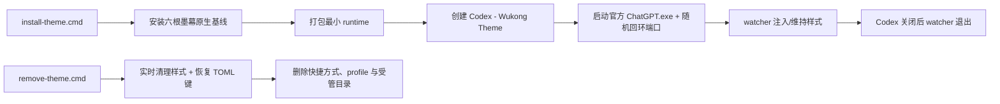

# 大圣归来 · 六根墨幕 — 设计与实现

## 设计来源

背景继续使用用户指定的 `大圣归来.jpg`。组件语言不再来自通用“古风卡片”，而是从用户本地 `11891心猿.jpg` 战绩页提炼：大面积无框墨幕、放射圆盘、六点印记、细水平线和少量暖金。`金箍.jpg` 提供熔金棍势与暗绿黑环境的明暗关系，`封面.png` 提供黑底金绘与朱砂小印的比例。三张参考图只用于观察，不进入运行包。

## 三个母题

| 母题 | 应用位置 | 设计特征 |
| --- | --- | --- |
| 六根盘 | 新对话标题、项目选中 | 标题背后由 radial/conic gradient 组成放射盘；选中项目用六个微点形成印记 |
| 无框墨幕 | 侧栏、右栏、用户气泡、菜单 | 黑绿墨色由实到虚，不使用逐项卡片边框；层级由细线、明度和局部朱砂表达 |
| 单线棍势 | 输入框、任务栏、代码 | 一条旧金到朱砂的水平亮线贯穿墨台；工具按钮是石符轮廓，发送键是熔金圆印 |

配色为暖骨白 `#d6cfbd`、墨绿黑 `#20221e`、旧金 `#a68b58`、朱砂 `#7f352e`、灰青 `#596b61`。亮色只用于文字、放射线、六点印和交互焦点；背景画面保留中等亮度，不铺白纸，也不退回近黑纯色。

## 双页面状态

- `landing`：`大圣归来.jpg` 高显影；原生标题文字不改，背后叠放射六根盘；原生输入框在原位置呈悬浮墨台。
- `thread`：背景增加墨色 wash；用户气泡只有墨迹材质和右侧朱砂影，助手回答背景/边框/阴影全部为 none；代码仍使用独立墨面以维持可读性。

状态由 Codex 当前数据属性、路由和消息证据判定；MutationObserver 以 110 ms 合并刷新。没有额外主题开关、侧栏、底栏或状态卡。

## 几何与内容契约

运行时优先使用当前 Codex 的稳定属性：

- `data-thread-find-target="conversation"`
- `data-thread-find-composer="true"`
- `data-virtualized-turn-content`
- `data-content-search-turn-key`
- `data-user-message-bubble`
- `data-local-conversation-final-assistant`
- `data-vscode-context*="supportsNewChatMenu"`

标记器只给现有节点增加 `forge-*` class 和 `data-forge-mark`。用户样式只落到真正的 `data-user-message-bubble`，不标记外层 anchor；唯一新增元素是 `head` 内的一个受管 `<style>`。运行时不写入任何提示词或回答节点。

CSS 不设置输入框或消息的 `width`、`height`、`padding`、`margin`、定位或 transform。棍线是 composer 的 background layer，不再为装饰覆盖宿主 `position`。定向测试在注入前后逐项比较 composer、用户气泡、助手回答和代码块 DOMRect，fixture 的原生 composer 基线为 736 px，并比较整段 `innerText`。

恢复表达式断开 observer、移除 listener/style/class/data 标记，并清空 landing/thread 状态。测试断言 body 子节点数不增加、清理后受管标记为零。

## 生命周期

默认 Chromium profile 会忽略远程调试参数，因此受管入口使用主题目录内的隔离 web profile。官方 Store 包路径在每次启动时通过 `Get-AppxPackage OpenAI.Codex` 解析，更新后无需写死版本路径。

## 配置恢复

原生基线用于启动前和非注入表面：`appearanceTheme=dark`，`appearanceDarkChromeTheme` 使用墨绿黑、暖骨白与旧金。已有安装可原位升级：引擎先按旧 state 精确还原安装前基线，再应用新定义并生成新 state；卸载仍能回到主题安装前的用户值。

恢复只操作主题持有的 TOML section/key。若用户安装后改过某键，恢复保留用户值并输出警告，不回滚整份配置。

## 性能与兼容

| 项目 | 设计值 |
| --- | --- |
| 背景网络请求 | 0，本地 JPEG 以内嵌 data URL 使用 |
| 新增 body 节点 | 0 |
| 样式节点 | 1，位于 head |
| observer | 1，110 ms 合并 |
| watcher | 1 个 Node 进程，1.7 s 存活探测 |
| 调试端口 | 随机、仅 `127.0.0.1` |
| 官方文件写入 | 0 |

选择器以稳定属性和角色为主，哈希 class 变化时由几何 fallback 承接；Codex 大版本更新后仍必须执行真实 DOM 截图审计。
