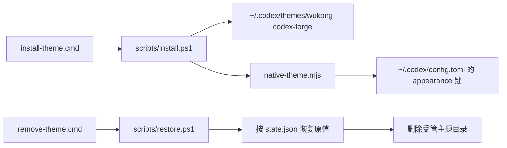

# 大圣归来 · 玄金 — 原生主题设计

## 设计决策

0.3.0 将部署机制收敛为 Codex 自身的 Chrome Theme。页面 DOM、三栏结构、菜单、按钮、输入框和环境信息完全由 Codex 维护；主题包只提供原生 token，不再模拟或覆盖宿主布局。

签名视觉由四个角色构成：

| 角色 | 值 | 目的 |
| --- | --- | --- |
| 玄黑表面 | `#0d100e` | 低反光、统一侧栏与工作区基底 |
| 暖纸正文 | `#f2e4c8` | 提供古卷感，同时保持长文可读性 |
| 烬金行动 | `#d6a85f` | 主按钮、焦点和技能语义 |
| 青绿新增 | `#86a96d` | 与烬金区分的成功和新增语义 |

`contrast = 74` 让 Codex 从上述种子色自动派生按钮 hover、选中项、边界、输入面和悬浮表面。颜色生成仍由 Codex 完成，因此不会因主题 CSS 选择器失效而破坏新版本页面。

代码面使用内置 Vesper，UI 使用 Microsoft YaHei UI，代码字体使用 JetBrains Mono；缺失时由系统正常回退，不发起字体网络请求。

## 部署结构

正式安装目录只包含：

- `theme.json`：原生 token 定义。
- `preview.jpg`：用户提供的视觉预览素材，不参与运行时绘制。
- `native-theme.mjs`：值级安装/恢复引擎。
- `state.json`：被接管键的安装前行值和受控路径。
- `LICENSE`。

没有常驻进程、端口、observer、CDP、额外 profile、开始菜单入口或 ChatGPT 启动器。

## 运行时加载边界

Codex 26.715.2305.0 的桌面设置存储在主进程启动时读取 `[desktop]`，通过应用内部的受信任 `set-setting` IPC 才会执行实时副作用（包括窗口 backdrop 刷新）。外部安装器直接改写 `config.toml` 不会进入这条 IPC 路径，且当前主进程没有该文件的变更监听。

应用注册的 `codex://codex-app/apply-config` 深链名称看似可复用，实际只读取 `~/.codex/codex-app/config.json` 的远程连接 schema；它不重新初始化桌面设置。公开深链解析也没有外观赋值或外观刷新路由。因此，在“不重载、不重启、不注入”的约束下，配置文件型主题无法改变已经打开的窗口。详见 [运行时热应用调查](RUNTIME_FINDINGS.md)。

## 配置恢复模型

安装器按 TOML section/key 处理配置，不复制整份 `config.toml` 作为回滚源：

1. 记录每个受管键是否存在及其原始整行。
2. 写入主题对应的 TOML literal。
3. 卸载时仅在当前值仍等于主题值时恢复。
4. 若用户在安装后改过该键，保留用户新值并报告警告。
5. 与主题无关的模型、MCP、插件、项目和权限配置从不参与恢复。

目标路径必须精确等于 `%USERPROFILE%\.codex\themes\wukong-codex-forge`，且卸载时拒绝 reparse point、缺失 marker 或路径不匹配的状态。

## 当前不实现的视觉

Codex 26.715.2305.0 的原生 schema 没有背景图片、任意 CSS、页面状态变体或宠物插槽。因此以下构想保留在 Studio/素材层，不进入 0.3.0 运行时：

- `大圣归来.jpg` 的 landing/thread 双显影背景。
- 小悟空宠物。
- 消息、代码块或输入框的自定义选择器样式。

这不是性能降级开关，而是原生扩展边界。若未来 Codex 提供相应字段，再从预览资产升级，不重新引入 DOM 注入。

## 性能与稳定性

| 项目 | 运行时成本 |
| --- | --- |
| 常驻进程 | 0 |
| 监听端口 | 0 |
| 主题网络请求 | 0 |
| 新增 DOM | 0 |
| MutationObserver | 0 |
| 安装包 | 约 88 KB |
| 官方包修改 | 0 |

本方案对 Codex 更新的兼容点是原生设置字段，而不是易变 DOM 类名；但它目前只具备下次启动加载能力，不具备当前窗口热应用能力。
